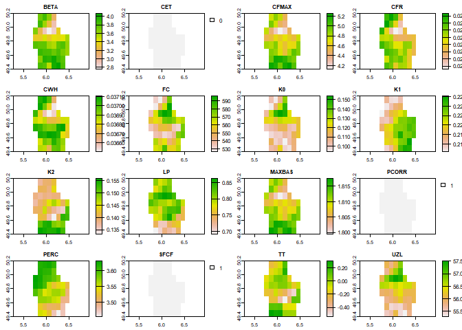

<!-- README.md is generated from README.Rmd. Please edit that file -->

# HBVr 

<!-- badges: start -->

[](https://lifecycle.r-lib.org/articles/stages.html#experimental)
[](https://github.com/atsyplenkov/HBVr/actions/workflows/R-CMD-check.yaml)
[](https://github.com/atsyplenkov/HBVr/commits/master)
[](https://www.repostatus.org/#active)
[](https://codecov.io/gh/atsyplenkov/HBVr)
<!-- badges: end -->

The goal of HBVr is to ease the accessebility of HBV Global Parameter
maps created by Beck et al. ([2020](http://www.gloh2o.org/hbv/)).
Therefore this one-function package allows to download any of the
cross-validation folds for your particular area of interest (AOI).

## Installation

You can install the development version of HBVr from
[GitHub](https://github.com/) with:

``` r
# install.packages("devtools")
devtools::install_github("atsyplenkov/HBVr")
```

## Disclaimer

While `HBVr` does not redistribute the data or provide it in any way, we
encourage users to cite original papers when using this package:

> Beck HE, Pan M, Lin P, Seibert J, van Dijk AIJM, Wood EF. 2020. Global
> Fully Distributed Parameter Regionalization Based on Observed
> Streamflow From 4,229 Headwater Catchments. Journal of Geophysical
> Research: Atmospheres 125 : e2019JD031485. DOI: 10.1029/2019JD03148

## Example

You can download mean zonal statistics

``` r
library(HBVr)

# Locate the shapefile
f <- system.file("ex/lux.shp", package="terra")
# Read it as SpatVector
v <- vect(f)

zonal_stat <- 
  hbv_get_parameters(
    aoi = v,
    folds = 1,
    mean = TRUE
  )
#> Downloading rasters...
#> Cropping rasters...

zonal_stat
#> $fold_0
#>                mean
#> BETA     3.59133975
#> CET      0.00000000
#> CFMAX    4.76274042
#> CFR      0.02329523
#> CWH      0.03688424
#> FC     557.79513737
#> K0       0.11312447
#> K1       0.22010622
#> K2       0.14379373
#> LP       0.78630368
#> MAXBAS   1.80986611
#> PCORR    1.00000000
#> PERC     3.55778855
#> SFCF     1.00000000
#> TT      -0.06733536
#> UZL     56.14696222
```

or retrieve a `SpatRaster` objects:

``` r

rasters <- 
    hbv_get_parameters(
    aoi = v,
    folds = 1,
    mean = FALSE
  )
#> Downloading rasters...
#> Cropping rasters...
#> Projecting rasters...

plot(rasters[[1]])
```


