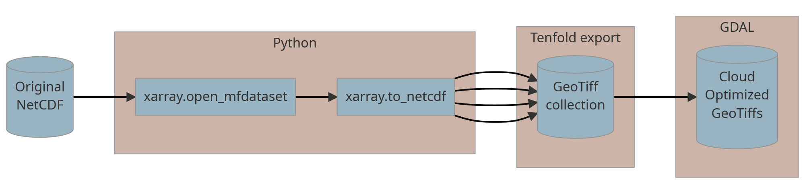

<!-- Some JS magic from SO -->
<!-- https://stackoverflow.com/a/65655397/9300556 -->

```{r, include = FALSE}
knitr::opts_chunk$set(
  collapse = TRUE,
  comment = "#>"
)
```

<script>
$(document).ready(function() {

  $chunks = $('.fold');

  $chunks.each(function () {

    if ( $(this).hasClass('s') ) {
      $('pre.r', this).prepend("<div class=\"showopt\">Show Source</div><br style=\"line-height:22px;\"/>");
      $('pre.r', this).children('code').attr('class', 'folded');
    }

    if ( $(this).hasClass('o') ) {
      $('pre:not(.r)', this).has('code').prepend("<div class=\"showopt\">Show Output</div><br style=\"line-height:22px;\"/>");
      $('pre:not(.r)', this).children('code:not(r)').addClass('folded');

      // add button to plots
      $(this).find('img').wrap('<pre class=\"plot\"></pre>');
      $('pre.plot', this).prepend("<div class=\"showopt\">Show Plot</div><br style=\"line-height:22px;\"/>");
      $('pre.plot', this).children('img').addClass('folded');

    }
  });

  // hide all chunks when document is loaded
  $('.folded').css('display', 'none')

  // function to toggle the visibility
  $('.showopt').click(function() {
    var label = $(this).html();
    if (label.indexOf("Show") >= 0) {
      $(this).html(label.replace("Show", "Hide"));
    } else {
      $(this).html(label.replace("Hide", "Show"));
    }
    $(this).siblings('code, img').slideToggle('fast', 'swing');
  });
});
</script>


<style>
.showopt {
  background-color: #648da3;
  color: #000000; 
  width: 100px;
  height: 20px;
  text-align: center;
  vertical-align: middle !important;
  float: left;
  font-family: sans-serif;
  border-radius: 8px;
}

.showopt:hover {
    background-color: #aa5e4e;
    color: #000000;
}

pre.plot {
  background-color: white !important;
}
</style>


## 1) Disclaimer & Preprocessing logic
Beneath is the example how can one download and preprocess HBV parameter maps created by Beck et al. ([2020](http://www.gloh2o.org/hbv/)). The initial dataset was distributed as NetCDF file. The package provides an opportunity to retreive original (v0.8) and revised (v0.9) versions of the datasets. The **v0.8** version contains ten cross-validation folds of 12 parameters:

- **BETA** -- Shape coefficient of recharge function
- **FC** -- Maximum soil moisture storage (mm)
- **K0** -- Recession coefficient of upper zone (day<sup>−1</sup>)
- **K1** -- Recession coefficient of upper zone (day<sup>−1</sup>)
- **K2** -- Recession coefficient of lower zone (day<sup>−1</sup>)
- **LP** -- Soil moisture value above which actual evaporation reaches potential evaporation
- **PERC** -- Maximum percolation to lower zone (mm day<sup>−1</sup>)
- **UZL** -- Threshold parameter for extra outflow from upper zone (mm)
- **TT** -- Threshold temperature (°C)
- **CFMAX** -- Degree‐day factor (mm °<sup>−1</sup>1 day<sup>−1</sup>)
- **CFR** -- Refreezing coefficient
- **CWH** -- Water holding capacity

In the **v0.9** version authors added four more parameters:

- **MAXBAS** -- base of the triangular routing function (days)
- **SFCF** -- Snowfall correction factor (-)
- **PCORR** -- general precipitation correction factor (-)
- **CET** -- potential evaporation correction factor (-)


We converted every fold to the Cloud-Optimized GeoTiff (COG) using the following GDAL command: `gdal_translate ordinary.tif COG.tiff -co COPY_SRC_OVERVIEWS=YES -co COMPRESS=LZW -co TILED=YES`. The final COG was validated using the python [script](https://github.com/OSGeo/gdal/blob/master/swig/python/gdal-utils/osgeo_utils/samples/validate_cloud_optimized_geotiff.py). Thus we ended up with 10 COGs with 12 bands each.

Overall logic of the preprocessing workflow (for v0.8 version) can be visualized as follows:
<center>
{width="100%"}
</center>

## 2) Example workflow

The essential aim of the `hbv_get_parameters` function is to ease the accessibility of HBV parameter maps created by Beck et al. ([2020](http://www.gloh2o.org/hbv/)). Therefore this function allows to download any of the cross-validation folds for your particular area of interest (AOI).

Let's imagine, you need to download **first**, **second** and **fifth** folds for the Luxembourg.

```{r, message=TRUE, warning=FALSE, out.width = "90%", fig.align='center'}
library(HBVr)
# library(tmap) # for vizualisztion purposes
# library(sf) # for vizualisztion purposes

# Locate the shapefile
f <- system.file("ex/lux.shp", package="terra")
# Read it as SpatVector
v <- vect(f)

# Plot it!
# tmap_mode("view")
# 
# tm_basemap("Stamen.Terrain") +
#   tm_shape(st_as_sf(v)) +
#   tm_polygons()
```

Initially, the `hbv_get_parameters` function has two types of output. First is the mean zonal statistics which is computed with `terra::global` in the background. Second one is the simple `SpatRaster` output.

To download 1, 2 and 5 folds we need to specify it in the function. Here is the example how can we retrieve mean values for the entire Luxembourg.

```{r, message=FALSE, warning=TRUE}
zonal_stat <- 
  hbv_get_parameters(
    AOI = v,
    folds = c(1, 2, 5),
    mean = TRUE
  )
```

The output of `zonal_stat` is hidden below ↓ 

<div class="fold s o">
```{r}
zonal_stat
```
</div>


To download `SpatRaster` objects we need to run the following code chunk:
```{r, message=FALSE, warning=TRUE}

rasters <- 
  hbv_get_parameters(
    AOI = v,
    folds = c(1, 2, 5),
    mean = FALSE
  )

```

The output of `rasters` is hidden below ↓ 

<div class="fold s o">
```{r}
rasters
```
</div>

The function returns a list of `SpatRaster` objects. The first one, i.e. Fold 1, can be plotted like this:

```{r message=FALSE, warning=FALSE, out.width="50%"}
plot(rasters[[1]])
```

<!-- It can be plotted with `tmap` for example: -->
<!-- ```{r message=FALSE, warning=FALSE, out.width="100%"} -->
<!-- # Plot it! -->
<!-- tmap_mode("view") -->

<!-- tm_basemap("Stamen.Terrain") + -->
<!--   tm_shape(rasters[[1]]$beta) + -->
<!--   tm_raster() -->
<!-- ``` -->
